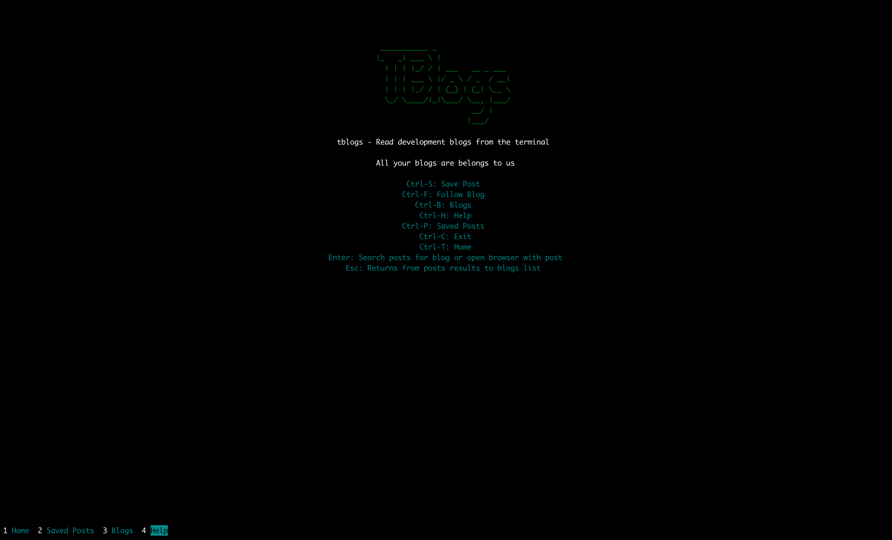
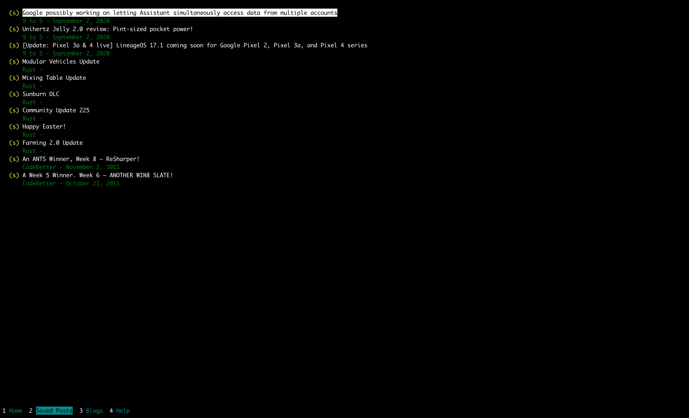

# TBlogs

## Summary
TBlogs is a basic app for your terminal that allows you to read, follow and save posts from development blogs from lots of companies.

## What It Looks Like

## Other screens

### Help section

### Blogs section

### Saved Posts

## Install
You can install by the following set of instructions:

1. Clone or download the repo, and navigate to the repo directory
2. Just run `go run .` inside the repo directory
3. You can also try compiling it with:
    - `make` - Work in progress
3. Assuming the binary has built correctly, you can simply run the file inside the bin directory:

## Usage

Start the app by running `go run .` or `go build .` and then run `./tblogs` to open it.

At first you will land on the help page just for this time.

Then you can simply use it with the shortcuts or with the mouse.

## Shortcuts
- `Ctrl + H` opens the Help page
- `Ctrl + B` opens the Blogs page
- `Ctrl + T` opens the Home page (T for tblogs)
- `Ctrl + P` opens the Saved Posts page
- `Ctrl + S`
    - Follow/unfollow a blog. Once the blog is followed, you will see the posts in your Home page
    - Save/unsave a post. After this, you can see it in the Saved Posts page even if you're not following the blog
- `Ctrl + F` search a blog or post depending on the screen that is selected
- `Enter`
    - If you have a blog selected from the Blogs page, then you will be able to read the posts
    - If you have a post selected, a browser will display the post
- `Esc` returns from the Posts results to the Blog pages

## Contributing

If you find any bugs, please report them! I am also happy to accept pull requests from anyone.

You can use the [GitHub issue tracker](https://github.com/ezeoleaf/tblogs/issues)
to report bugs, ask questions, or suggest new features.

For a more informal talk, just ping me <ezeoleaf@gmail.com> :)
